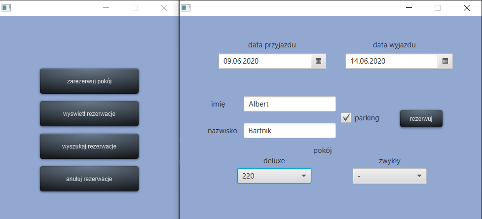
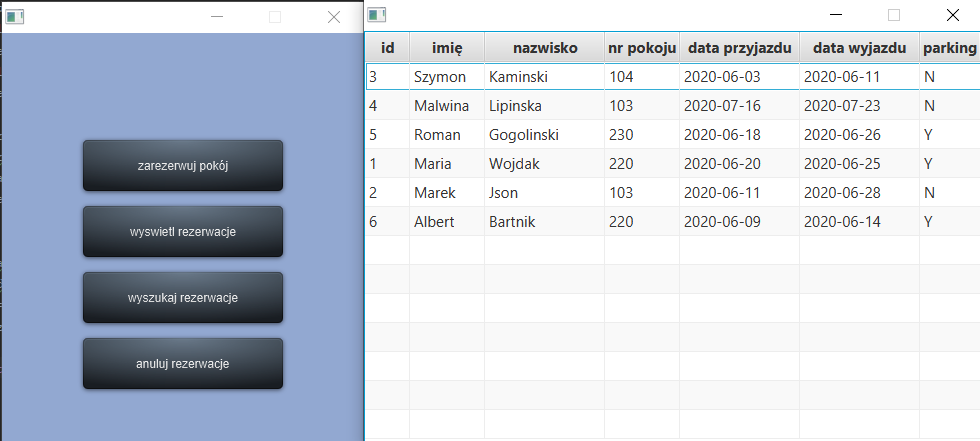

# Hotel Management

A simple client-server based app, that simulates hotel management;
adding and removing reservations, managing staff.
The data is stored in oracle DB.

## Prerequisites & Running

In order to make the app work, you need to have a local Oracle database on your device.
Create required tables and triggers using code in the .sql file
### How does it work
You can display a list of current reservations

You can also add/remove a reservation

The change was saved in database 

